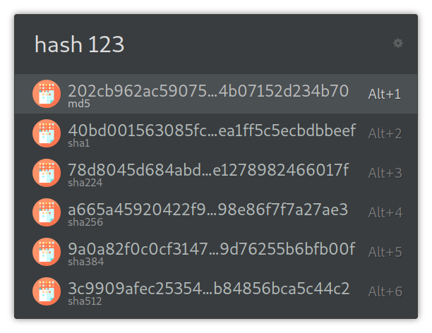

# ulauncher-hash2
[Ulauncher](https://ulauncher.io/) extension to generate hashes with md5, sha1 and sha2 (sha224, sha256, sha384 and sha512).

## Usage
Install in Ulauncher using this url (https://github.com/friday/ulauncher-hash2), then use the algorithm you want or `hash` as a keyword

## Credits
* The [icon](https://www.flaticon.com/free-icon/encryption_418404) was created by [freepik](https://www.flaticon.com/authors/freepik) from [www.flaticon.com](https://www.flaticon.com/).
* [Bruno Paz](https://github.com/brpaz) for the original [ulauncher-hash](https://github.com/brpaz/ulauncher-hash) (please merge my [PR](https://github.com/brpaz/ulauncher-hash/pull/4)).
